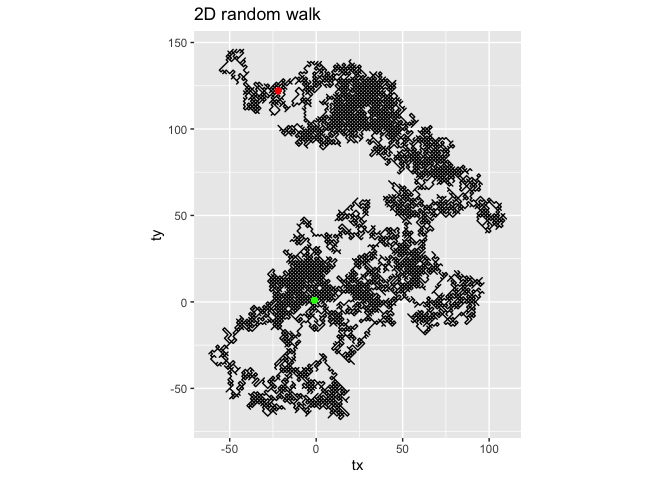

Brownian Motion
================

## Simple Random Walk

Imagine a point that starts at 0 on a 1D number line. A number is picked
between 1 and 2.

The point moves left if 1 is picked and it moves right if 2 is picked.

Theoratically, the expected value should be 0 as the chances of moving
left and moving right are exactly the same, 50%.

However, reality shows that that will often not be the case. The
distribution seems completely random.

Below is a histogram showing the distribution frequency of where the
point lands on the number line after 10 ***million*** steps.

Even though the peak might not be at or near 0, these peaks resemble the
normal distribution curve.

``` r
## define plot data
xlim = c(-20,20)
ylim = c(0,1)
px = 0
py = 0

ts = array(0, dim = 1)
# plot_number_line()
for (a in 1:1000000){
  pick = sample(1:2, 1)
  if (pick == 1) {px = px - 01}
  else {px = px + 1}
  ts[a+1] = px
  # plot_number_line(px,py)
}
par(mar = c(2,2,2,2))
hist(ts, freq=T, breaks = length(unique(ts)))
```

<!-- -->

### Porbability of returning to 0
