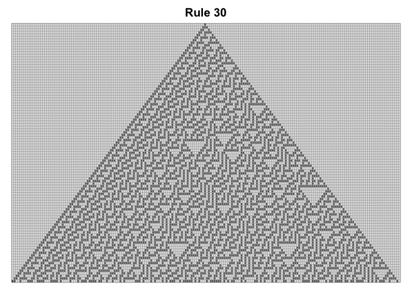
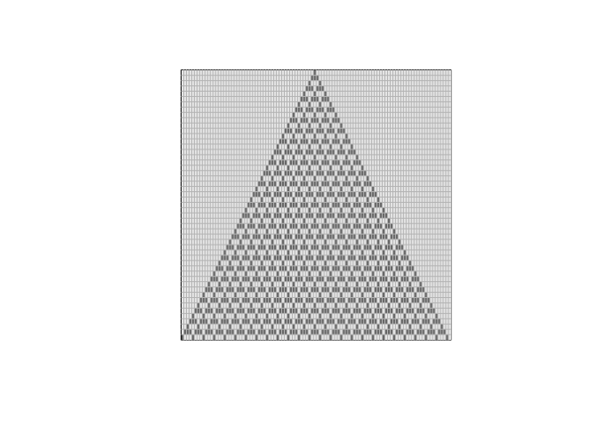

Cellular_automata
================
2022-07-12

## displaying the grid

``` r
display <- function(mat){
  par(pty="s") # square
  image(t(apply(mat,2,rev)), col=c("grey90", "grey40"), yaxt="n", xaxt="n")
  grid(nx = ncol(mat), ny = nrow(mat),col="grey70", lty=1)  
}
```

## Initialize a matrix

``` r
init <- function(n){
  mat = matrix(0,nrow=n, ncol=n*2)
  mat[1,ceiling(n)]=1
  return (mat)
}
```

## Writing loop for Game of Life Rule 30

``` r
rule30 <- function(mat, iter){
  for (k in 1:iter) {
    for (i in 1:ncol(mat)){
      L = i-1
      R = i+1
      # for wrap around effect
      if (L == 0){L = ncol(mat)}
      if (R == ncol(mat) +1 ){R = 1}
      # rule 30 states: left XOR (mid OR right)
      # populating table downwards
      if (isTRUE(xor(mat[k,L], mat[k,i] || mat[k,R]))) {
        mat[k+1,i] = 1}
    }

  }
  display(mat)
}
```

## Writing loop for Game of made up rule

``` r
rule_mine <- function(mat, iter){
  for (k in 1:iter) {
    for (i in 1:ncol(mat)){
      L = i-1
      R = i+1
      # for wrap around effect
      if (L == 0){L = ncol(mat)}
      if (R == ncol(mat) +1 ){R = 1}
      # my rule states: mid XOR left OR right)
      # populating table downwards
      if (isTRUE(xor(mat[k,i], mat[k,L] || mat[k,R]))) {
        mat[k+1,i] = 1}
    }

  }
  display(mat)
}
```

## Display an example of 100 iterations of Rule30

``` r
mat=init(51)
rule30(mat,50)
```

<!-- -->

``` r
rule_mine(mat,50)
```

<!-- -->
