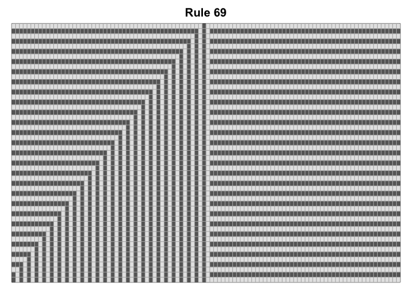
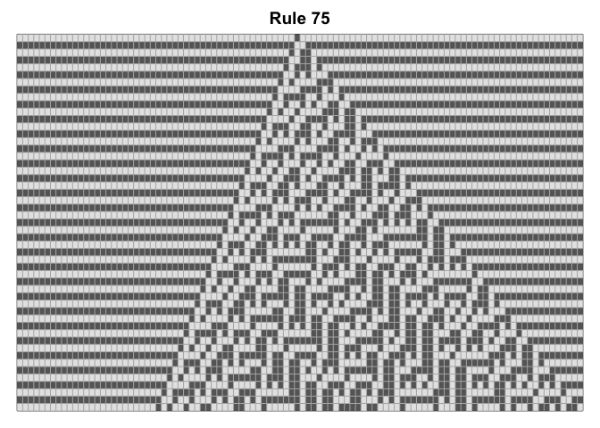
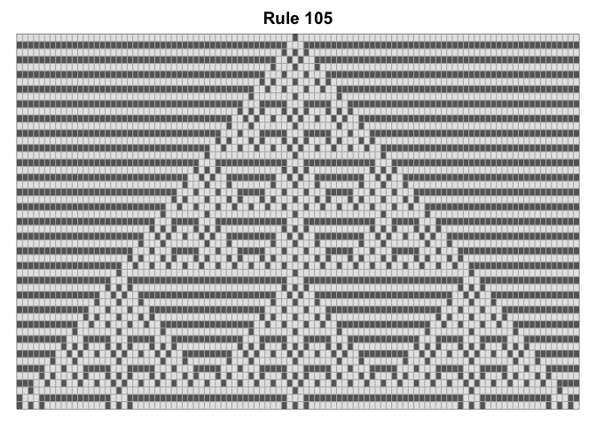
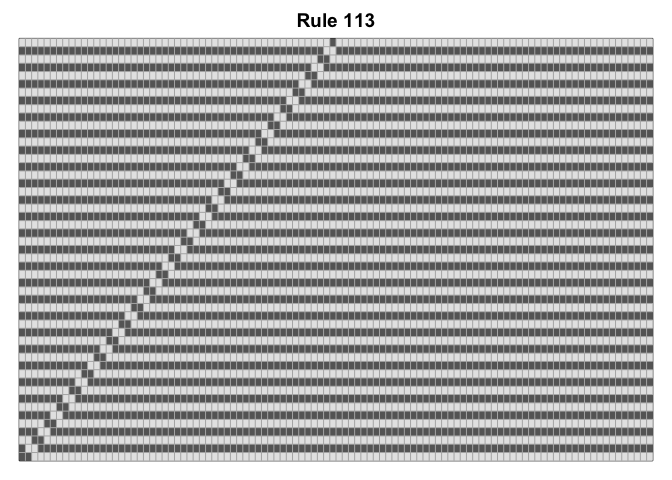

Elementary_cellular_automata
================
2022-07-12

# Objective

The purpose of this exercise is to understand the behaviour of
elementary celluarl automata (1D) before moving into modeling 2D
cellular automata (CA). We will first pick one rule and move on into
generating all 256 rules.

## Rule 30

This rule is special because it matches the condition “Left cell XOR
(Center cell OR Right cell)”.

This makes rule 30 a good place to start for coding.

Below, a matrix of selected size is initialized and Rule 30 is applied
for desired number of iterations.

``` r
rule30 <- function(mat, iter){
  for (k in 1:iter) {
    for (i in 1:ncol(mat)){
      L = i-1
      R = i+1
      # for wrap around effect
      if (L == 0){L = ncol(mat)}
      if (R == ncol(mat) +1 ){R = 1}
      # rule 30 states: left XOR (mid OR right)
      # populating table downwards
      if (isTRUE(xor(mat[k,L], mat[k,i] || mat[k,R]))) {
        mat[k+1,i] = 1}
    }

  }
  display(mat,30)
}
```

## Display an example of 100 iterations of Rule30

``` r
mat=init(101)
rule30(mat,100)
```

<!-- -->

Here we will display each iteration of rule 30


# The elementary CA numbering system

In all of Wolfram’s elementary cellular automata, an infinite
one-dimensional array of cellular automaton cells with only two states
is considered, with each cell in some initial state. At discrete time
intervals, every cell spontaneously changes state based on its current
state and the state of its two neighbors.

There are only 8 possible current patterns and Stephen Wolfram
standardized the order of such configuration.

111, 110, 101, 100, 011, 010, 001, 000

The binary equivalent of the rule number will be the new state of the
corresponding current pattern.

For instance, rule 30 has the binary equivalent of 00011110:

| current pattern | 111 | 110 | 101 | 100 | 001 | 010 | 001 | 000 |
|:---------------:|:---:|:---:|:---:|:---:|:---:|:---:|:---:|:---:|
|    new state    |  0  |  0  |  0  |  1  |  1  |  1  |  1  |  0  |

By this logic, we can drive the new state for all 256 rules.

All we need to do is convert all rule numbers: 0-255 into binary format
and map each current patter to its corresponding new state.

## Decimal to binary converter

Quick decimal to binary calculator, using strings to make a named list
in the next step.

``` r
Dec2Bin <- function(n){
  bsum = 0
  bexp = 1
  while (n >0){
    mod = n %% 2
    n = floor(n/2)
    bsum = bsum + mod * bexp
    bexp = bexp *10
  }
  bsum = sprintf("%08s",toString(format(bsum, scientific = F))) # format to avoid sci notations, e+05 etc
  
  return (bsum)
}
```

## Setting up state_rules with named list

``` r
state_rules <- function(rule_num){
  binstr = strsplit(Dec2Bin(rule_num),"")[[1]]
  patterns = c("111", "110", "101", "100", "011", "010", "001", "000")
  new_state = as.list(binstr)
  names(new_state) = patterns
  return(new_state)
}
```

## Writing loop for Game of Life for all rules

``` r
rule_any <- function(mat, iter, rule_num = 30){
  # get state rules
  state_rule = state_rules(rule_num)
  
  # loop through array
  for (k in 1:iter) {
    for (i in 1:ncol(mat)){
      L = i-1
      R = i+1
      # for wrap around effect
      if (L == 0){L = ncol(mat)}
      if (R == ncol(mat) +1 ){R = 1}
      cur_pattern = paste(c(mat[k,L], mat[k,i],mat[k,R]), collapse = "") #only two lines of change
      mat[k+1,i]= strtoi(state_rule[cur_pattern][[1]])
    }

  }
  display(mat, rule_num)
}
```

## Generate all 256 rules (0-255)

As you will see, not all rules have special patterns. But this is
another topic for another time.

``` r
mat_size = 51 #pick odd number for better visualization()
mat=init(mat_size)
for (i in 0:255){
  rule_any(mat,mat_size-1,i)
}
```

<!-- --><!-- --><!-- --><!-- --><!-- --><!-- --><!-- --><!-- --><!-- --><!-- --><!-- --><!-- --><!-- --><!-- --><!-- --><!-- --><!-- --><!-- --><!-- --><!-- --><!-- --><!-- --><!-- --><!-- --><!-- --><!-- --><!-- --><!-- --><!-- --><!-- --><!-- --><!-- --><!-- --><!-- --><!-- --><!-- --><!-- --><!-- --><!-- --><!-- --><!-- --><!-- --><!-- --><!-- --><!-- --><!-- --><!-- --><!-- --><!-- --><!-- --><!-- --><!-- --><!-- --><!-- --><!-- --><!-- --><!-- --><!-- --><!-- --><!-- --><!-- --><!-- --><!-- --><!-- --><!-- --><!-- --><!-- --><!-- --><!-- --><!-- --><!-- --><!-- --><!-- --><!-- --><!-- --><!-- --><!-- --><!-- --><!-- --><!-- --><!-- --><!-- --><!-- --><!-- --><!-- --><!-- --><!-- --><!-- --><!-- --><!-- --><!-- --><!-- --><!-- --><!-- --><!-- --><!-- --><!-- --><!-- --><!-- --><!-- --><!-- --><!-- --><!-- --><!-- --><!-- --><!-- --><!-- --><!-- --><!-- --><!-- --><!-- --><!-- --><!-- --><!-- --><!-- --><!-- --><!-- --><!-- --><!-- --><!-- --><!-- --><!-- --><!-- --><!-- --><!-- --><!-- --><!-- --><!-- --><!-- --><!-- --><!-- --><!-- --><!-- --><!-- --><!-- --><!-- --><!-- --><!-- --><!-- --><!-- --><!-- --><!-- --><!-- --><!-- --><!-- --><!-- --><!-- --><!-- --><!-- --><!-- --><!-- --><!-- --><!-- --><!-- --><!-- --><!-- --><!-- --><!-- --><!-- --><!-- --><!-- --><!-- --><!-- --><!-- --><!-- --><!-- --><!-- --><!-- --><!-- --><!-- --><!-- --><!-- --><!-- --><!-- --><!-- --><!-- --><!-- --><!-- --><!-- --><!-- --><!-- --><!-- --><!-- --><!-- --><!-- --><!-- --><!-- --><!-- --><!-- --><!-- --><!-- --><!-- --><!-- --><!-- --><!-- --><!-- --><!-- --><!-- --><!-- --><!-- --><!-- --><!-- --><!-- --><!-- --><!-- --><!-- --><!-- --><!-- --><!-- --><!-- --><!-- --><!-- --><!-- --><!-- --><!-- --><!-- --><!-- --><!-- --><!-- --><!-- --><!-- --><!-- --><!-- --><!-- --><!-- --><!-- --><!-- --><!-- --><!-- --><!-- --><!-- --><!-- --><!-- --><!-- --><!-- --><!-- --><!-- --><!-- --><!-- --><!-- --><!-- --><!-- --><!-- --><!-- --><!-- --><!-- --><!-- --><!-- --><!-- --><!-- --><!-- --><!-- --><!-- --><!-- --><!-- --><!-- -->
