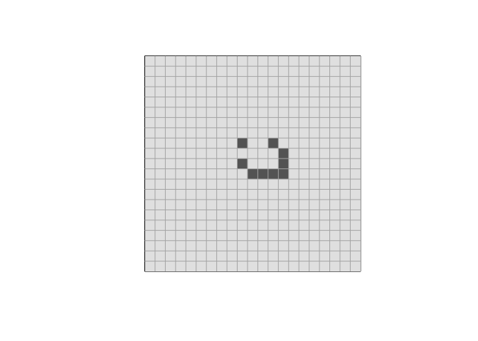

Cellular\_automata\_2D(Game of Life)
================
2022-07-13

# Objective

As we have briefly investigated 1d elementary cellular automata (CA), we
will now move to the 2D part and hopefully create some cool patterns\!
Game of life here we come\!

## Game of Life

Invented by John Conway in 1970s, this two-state, 2D CA has the
following rules:

  - Any live cell with fewer than two live neighbours dies, as if caused
    by underpopulation.
  - Any live cell with two or three live neighbours lives on to the next
    generation.
  - Any live cell with more than three live neighbours dies, as if by
    overpopulation.
  - Any dead cell with exactly three live neighbours becomes a live
    cell, as if by reproduction.

Here, a neighbour is defined as the all 8 cells surrounding the center
cell. This is called Moore neighborhood.

``` r
GoL <- function(mat, path, iter){
  save(mat, path, 0)
  for (k in 1:iter) {
    temp_mat = matrix(0,nrow(mat), ncol(mat))
    for (i in 1:ncol(mat)){
      for (j in 1:nrow(mat)){
        N = j-1
        S = j+1
        E = i+1
        W = i-1
        # for wrap around effect
        if (N == 0) {N = nrow(mat)}
        if (S == nrow(mat) + 1) {S = 1}
        if (E == ncol(mat) + 1) {E = 1}
        if (W == 0) {W = ncol(mat)}
        # check number of adjacent live cells
        count_lives = mat[N,i] + mat[S,i] + mat[j,E] + mat[j,W] + mat[N,W] + mat[N,E] + mat[S,W] + mat[S,E]
        # main logic from the 4 rules
        if (mat[j,i] == 1 && count_lives < 2)                     {temp_mat[j,i] = 0}
        if (mat[j,i] == 1 && (count_lives == 2|| count_lives == 3)){temp_mat[j,i] = 1}
        if (mat[j,i] == 1 && count_lives > 3)                     {temp_mat[j,i] = 0}
        if (mat[j,i] == 0 && count_lives == 3)                    {temp_mat[j,i] = 1}
      }
    }
    mat = temp_mat
    save(mat, path, k)
  }
}
```

## Oscillators

These are some patterns that will repeat itself after a certain number
of iterations. They stay in place and do not move around the map.

They come from different initial states

``` r
## Initialization of oscillators

# mat_size = 17
# mat=init(mat_size)
# # Blinker
# mat[2:4,3] = 1

# # Toad
# mat[3,3:5] = 1 
# mat[4,2:4] = 1

# # Beacon 
# mat[2:3,2:3] = 1
# mat[4:5,4:5] = 1

# # Pulsar
# mat[c(3,8), 5:7] = 1
# mat[5:7, c(3,8)] = 1
# tmp = t(apply(mat, 2, rev)) # rotating pattern for 90 degrees
# tmp2 = t(apply(tmp, 2, rev))
# tmp3 = t(apply(tmp2, 2, rev))
# mat = mat+tmp+tmp2+tmp3

# # Pentadecathlon
# mat[6:15,11] = 1
```

|                                                                                |                                                                              |
| :----------------------------------------------------------------------------: | :--------------------------------------------------------------------------: |
| Blinker |   Toad   |
|  Beacon  | Pulsar |


Pentadecathlon

## Spaceships

These are many patterns that will move across the screen. 4 of the most
common inistial states will be shown below.

``` r
## Initialization of spaceships


# Glider
glider = cbind(c(2,3,4,4,4), c(3,4,2,3,4))

# lightweight spaceship (LWSS)
lwss = cbind(c(2,2,3,4,4,5,5,5,5), c(3,6,7,3,7,4,5,6,7))

# midweight spaceship (MWSS)
mwss = cbind(c(2,3,3,4,5,5,6,6,6,6,6), c(5,3,7,8,3,8,4,5,6,7,8))

# heavytweight spaceship (HWSS)
hwss = cbind(c(2,2,3,3,4,5,5,6,6,6,6,6,6), c(5,6,3,8,9,3,9,4,5,6,7,8,9))

# # F-pentomino
# Fpen = cbind(c(2,2,3,3,4),c(3,4,2,3,3))

spaceship = list(glider, lwss, mwss, hwss)

for (i in spaceship) {
  mat_size = 21
  mat = init(mat_size)
  mat[i + (mat_size/2-3)] = 1
  display(mat)
}
```

<!-- --><!-- --><!-- --><!-- -->

### Spaceships in action

The simplest form of spaceship is ***Glider***. This 5 pixel pattern
will repeat itself every 4 iterations and it will go on
forever\!


Below are three different sizes of spaceships\! Light, medium, and
heavy.

|                                                                           |                                                                            |                                                                           |
| :-----------------------------------------------------------------------: | :------------------------------------------------------------------------: | :-----------------------------------------------------------------------: |
| Light | Medium | Heavy |

## Guns

Guns are patterns that will shot things out\! Essentially they generate
spaceships, most commonly the ***glider*** pattern.

### Initial states

``` r
## Initialization for guns

mat_size = 51
mat = init(mat_size)
# Gosper glider gun
squares = cbind(c(6,6,7,7,4,4,5,5), c(2,3,2,3,36,37,36,37))
body1 = cbind(c(4,4,5,5,6,6,7,7,7,7,8,8,9,9,10,10), c(14,15,13,17,12,18,12,16,18,19,12,18,13,17,14,15))
body2 = cbind(c(2,3,3,4,4,5,5,6,6,7,7,8), c(26,24,26,22,23,22,23,22,23,24,26,26))
gosper = rbind(squares,body1,body2)
mat[gosper] = 1
display(mat, "Gosper glider gun")
```

<!-- -->

``` r
# Simkin glider gun
mat_size = 51
mat = init(mat_size)
squares = cbind(c(2,2,2,2,3,3,3,3,5,5,6,6,13,13,14,14), c(2,3,9,10,2,3,9,10,6,7,6,7,33,34,33,34))
body1 = cbind(c(11,11,12,13,14,14,14), c(24,25,23,23,23,24,25))
body2 = cbind(c(11,11,12,13,14,15), c(27,28,29,30,29,28))
body3 = cbind(c(19,19,20,21,21,21,22), c(22,23,22,23,24,25,25))
simkin = rbind(squares, body1, body2, body3)
mat[simkin] = 1
display(mat, "Simkin glider gun")
```

<!-- -->

The *first* discovered gun is Gosper glider gun. This is the first
pattern that is known to be able to grow till infinity. The smallest
glider gun that exists is the Simkin glider gun. It only consists of 36
cells.

### Guns in action

**Gosper glider
gun**


**Simkin glider
gun**


## Puffers

These are spaceships that leave debris behind.

``` r
## Initialization for puffers


# Puffer 1
mat = init(14)
body1 = cbind(c(2,3,4,5,6,7,7,8,8,8), c(3,4,4,4,4,1,4,2,3,4))
body2 = cbind(c(2,2,3,3,4), c(7,8,7,8,7))
body3 = cbind(c(6,6,6,7,7,7,8), c(9,10,12,10,11,12,11))
lhs = rbind(body1, body2, body3)
mat[lhs] = 1
# getting indices of mirror image for right hand side
rhs = which(t(apply(mat,1,rev)) == 1, arr.ind = T)
rhs[23:44] = rhs[23:44] + 13
# adding them back together
puffer1 = rbind(lhs, rhs)
mat = init(151)
mat[puffer1+55] = 1
display(mat, "Puffer 1")
```

<!-- -->

``` r
# Puffer 2
mat = init(100)
body1 = cbind(c(2,3,4,5,5,6,6,6), c(4,5,5,5,2,3,4,5))
body2 = cbind(c(2,3,3,4,4,4), c(9,10,13,10,11,12))
body3 = body1
body3[9:16] = body3[9:16] + 14
puffer2 = rbind(body1, body2, body3)
mat[puffer2+40] = 1
display(mat, "Puffer 2")
```

<!-- -->

### Puffers in action


Puffer1


Puffer2

These are some of the most common patterns in Conway’s game of life.
There are many more to it.

Here is a [link](https://conwaylife.com/wiki/Main_Page) for those who
want to learn more about this simple yet complex “game”.
