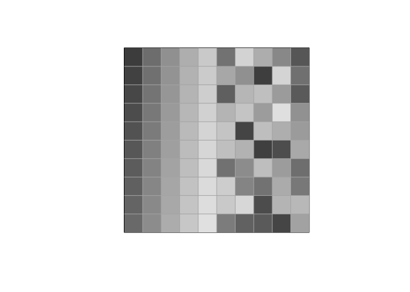
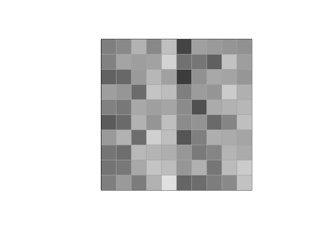
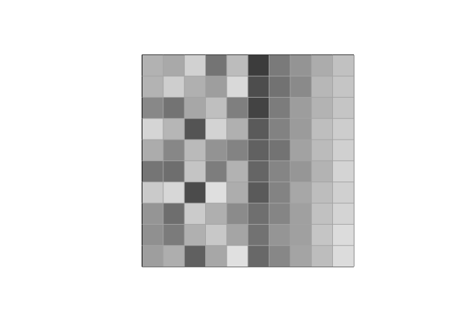
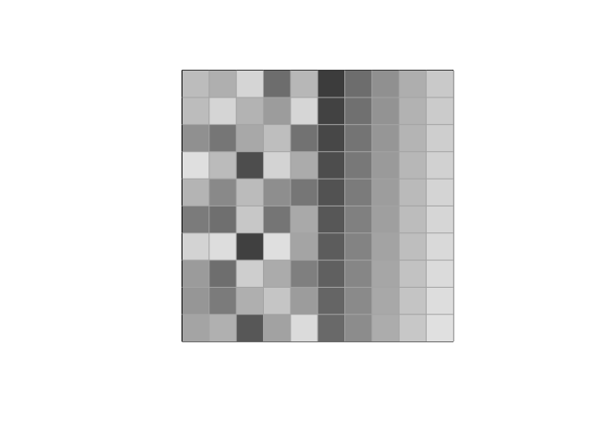

Turing\_Pattern
================

# Reaction-diffusion system

## Gray-Scott model

``` r
init <- function(size = 3){
a <- seq(0,1,length.out = size**2/2)
b <- runif(size**2, 0, 1)
m <- array(c(a,b), dim = c(size,size,2))
dimnames(m)[[3]] = c("A", "B")

return(m)
}
```

``` r
## To renew values

renew <- function(m,iter){
  for (a in 1:iter){
  tmp_m = array(0, dim = c(dim(m)[1], dim(m)[2], dim(m)[3]))
  # print(c("1", m[,,1], tmp_m[,,1]))
    for (i in 1:dim(m)[1]){
      for (j in 1:dim(m)[2]){
        tmp_m[i,j,1] =(m[i,j,1]+m[i,j,2])/2
        tmp_m[i,j,2] = m[i,j,2]
      }
    }
  # print(c("2", m[,,1], tmp_m[,,1]))
  m = tmp_m
  # print(c("3", m[,,1], tmp_m[,,1]))
  display(m[,,1])
  }
}
```

``` r
m <- init(10)
display(m[,,1])
```

<!-- -->

``` r
renew(m,200)
```

<!-- --><!-- --><!-- --><!-- --><!-- --><!-- --><!-- --><!-- --><!-- --><!-- --><!-- --><!-- --><!-- --><!-- --><!-- --><!-- -->
